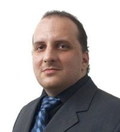

###### [[github.com/mionita1980](https://github.com/mionita1980)] . [mionita1980@proton.me] . [+40 728 29 28 79] . [[PDF](https://mionita1980.github.io/resume.pdf)] . [Jul 6, 1980]

### Over 23 years as a software engineer and solution architect, I've built deep expertise across specialized domains - telecom and AI - and general-purpose programming, integrating innovative solutions into my work.

## Skills

```pre-sales```
```delivery```
```system architecture & design```
```team-leading```
```programming```
```teaching```
```microlith```
```microservices```
```llm```
```ai```
```devops```
```databases```
```containers```
```linux systems administration```
```webservers```
```application servers```
```load/stress testing```

**Programming**: Java, C, C++, Python, Erlang, Javascript, Spring, Micronaut, TestContainers, Boost, Langchain
**Databases**: MySQL, Postgres, H2, sqlite, Cassandra, Oracle, SQL, CQL, GraphQL, OneNDS, Redis
**Linux**: Alpine, RedHat, Debian, Wolfi
**Documentation**: Markdown, ASCIIdoc, PlantUML, Mermaid
**Scripting**: bash, AWK, Perl
**DevOps**: Pipelines, Kubernetes, Docker, Terraform, Helm, Ansible, Crossplane, Openstack HOT, K3S, K3D, Skaffold, Vagrant
**Private Cloud**: Openshift, Openstack, Proxmox, VMWare
**Public Cloud**: Azure, AWS, Digital Ocean
**Monitoring**: Prometheus, Loki, Grafana, ELK, Micrometer, Open telemetry
**Testing**: K6, JMeter, Bruno, Postman/Newman
**AI**: Agentic AI workflows, AI Foundry, Azure Cognitive Services, MCP, Hugging Face, Mistral
**Protocols**: REST, SOAP, HTTP, TCP, IP, ICMP, Diameter, WebRTC, SIP, Sigtran, SS7, JMX, LDAP, SNMP, SMTP, Syslog
**Others**: Nix, ActiveMQ, dagger.io, Github actions, Azure pipelines, Gitlab CI/CD, XML, SAP-CC

## Experience

### Solution Architect, [mindit.io](https://mindit.io)

Mar 2024 - present, Bucharest, Romania

Presales (solution design, estimates) followed by proof-of-concept application development, as well as delivery (high level design, implementation, automated testing and deployment) activities.
Technical architecture ownership (end-to-end). I have led teams throughout, driving code reviews, technical direction, and mentoring of team members.

- Helped design and build agentic workflow frameworks for SDLC (software development lifecycle); led teams adopting these frameworks.
- Created project plan integrations that continuously evolve alongside project documentation, for both new and existing projects
- Architected a scalable education management system with AI safeguarding features, enabling early detection of issue concerning the education process.
- Designed multi-tenant RAG-based chat-bots for websites, enabling a human-like interaction for the customers’ usual queries.
- Incorporated AI-driven solutions, to enhance customer-facing procedures within a B2B agency, ensuring a more responsive initial client experience.

**Technologies used:** multi-agent AI, MCP, AI Foundry, Azure Cognitive Services, Azure Container Apps, Terraform, Java, Python, K6, Azure managed Redis, MySQL, bash, powershell

### Solution Architect, [RSystems](https://rsystems.com)

Dec 2020 - Mar 2024, Bucharest, Romania

Presales (solution design, estimates), delivery (from design to implementation and automated testing), support, team-lead and teaching activities.

- Architected custom telecommunication messaging platform, designed to maintain synchronization across various systems, using multiple retry mechanisms, enabling data-driven decision making to personalize a customer's experience. Designed for microservices with deployment on Kubernetes.
- Tier 3 support activities for containerized production systems, spread across multiple clusters

**Technologies used:** Java, Flight Recorder, ELK, Kubernetes, Helm, Skaffold, JMeter, Postman, bash, Spring, Openshift, Alpine, RedHat, CI/CD pipelines

### System Architect, [RSystems](https://rsystems.com)

Apr 2012 - Dec 2020, Bucharest, Romania

- Improved B2B services platform, for a telecommunication operator, enabling automated charging and reconciliation.
- Designed JAIN-SLEE based call-control solution, on private cloud infrastructure, for a telecommunication operator.
- Developed a comprehensive MVNO solution, ensuring fast time-to-market for a classic telecommunication operator's prepaid plans. The solution facilitated efficient charging, communication, and customer service, enabling the marketing department to come up with ever-changing customer offers.

**Technologies used:** Java, JAIN-SLEE, Rhino TAS, Erlang, SAP-CC, Openstack, Vagrant, Linux

### System Integrator, [RSystems](https://rsystems.com)

Aug 2011 - Apr 2012, Irving, Texas, US

- Integrated a AAA solution in a tier 1 US telecommunication operator's network.

**Technologies used:** OneNDS, OneAAA, LDAP, Diameter, Solaris

### System Architect, [Computaris](https://computaris.com)

Dec 2008 - Aug 2011, Bucharest, Romania

- Created an integration platform between a telecommunication operator and third-party service providers based on a AAA (Authentication, Authorization, Accounting) platform, to create additional revenue streams.
- Created additional components for that platform, interfacing with LDAP and GreenPlum databases.
- Created a performance test suite, based on Apache JMeter.

**Technologies used:** Java, JMeter, OneNDS, OneAAA, LDAP, GreenPlum, Linux

### Senior Software Engineer, [Computaris](https://computaris.com)

Mar 2007 - Dec 2008, Bucharest, Romania

- Customer base migration for a telecommunication operator, to a new provisioning platform, without service disruption.
- Provisioning platform development for multi-national operator.

**Technologies used:** Java, Teligent P90

### Software Engineer, [Computaris](https://computaris.com)

Mar 2006 - Mar 2007, Bucharest, Romania

- Developed an XML based platform for delivery of new telecommunication services, with very small time-to-market, including charging, provisioning and call-control capabilities.
- Ericsson Diameter charging SDK adaptation, for use in the XML based platform.

**Technologies used:** C++, Java, Diameter, XML, Linux

### Research Engineer, [University of the Bundeswehr](https://www.unibw.de)

Aug 2003 - Mar 2006, Munich, Germany

Delivery (implementation and testing) and support.

- Developed a structural assessment application, using OpenCascade and Sofistik, integrated with wireless communication technology to facilitate real-time measurement input.
- Support activities during application field testing; gathering user feedback and real input data.

## Languages

- Romanian: Native
- English: Full professional proficiency
- German: Limited working proficiency
- French: Elementary proficiency

## Education

### Bachelor in Engineering, [Politehnica Univerity of Bucharest](https://upb.ro)

1998 - 2003, Bucharest, Romania

- Information Technology
- CCNA (Cisco Certified Network Administrator) studies

2003, Munich, Germany, [University of the Bundeswehr](https://www.unibw.de)

- Bachelors dissertation
- Erasmus student exchange program
